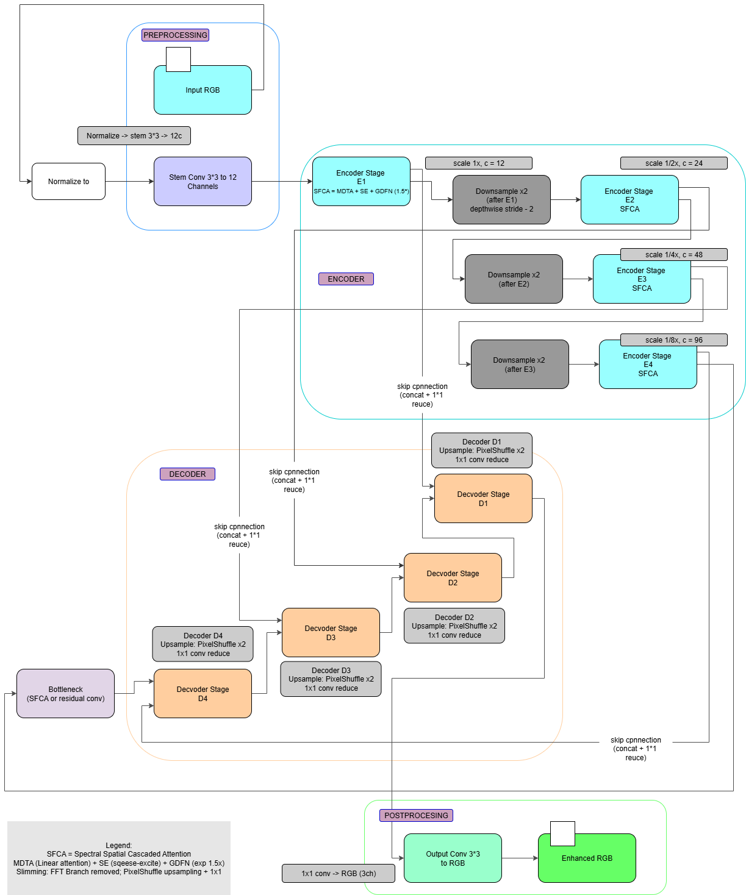

# Spectro-transformer: A Slimmed Architecture for Low-Light Image Restoration
# Refer to the link below to access the git repository for this project
https://github.com/Vaishnavi-TCD/LLIE_Multidata
## Overview

This repository contains the code and model implementations for a **Low-Light Image Enhancement (LLIE)** project. The goal of this project is to enhance the quality of low-light images by leveraging deep learning models, specifically improving:

- Brightness
- Noise reduction
- Image clarity

The primary model is based on the **SpectroFormer** architecture, which has been slimmed down for efficiency while maintaining high performance. This project also includes cross-dataset testing and evaluations using both **paired** and **unpaired** datasets.

## Table of Contents

1. [Prerequisites](#prerequisites)
2. [Dataset Preparation](#dataset-preparation)
3. [Training](#training)
4. [Fine-Tuning](#fine-tuning)
5. [Testing](#testing)
6. [Unpaired Testing](#unpaired-testing)
7. [File Structure](#file-structure)
8. [References](#references)

## Prerequisites

To run this project, you'll need the following:

- **Python 3.6** or higher
- **PyTorch 1.7.0** or higher
- **CUDA-compatible GPU** (for training large models)

### Required Python Libraries:

- torch
- torchvision
- numpy
- opencv-python
- tqdm
- matplotlib
- scikit-image
- scipy
- shapely

You can install the required libraries by running:

```bash
pip install -r requirements.txt
```

## Dataset Preparation

This project uses multiple datasets for training and evaluation:

### LOL v1 and LOL v2 (Low-Light Image Datasets)
- **Real and synthetic images** from the LOL dataset.
- Used for training and evaluating low-light image enhancement models.

### DICM (Unpaired Dataset)
- Used for **unpaired testing**, where the corresponding high-light images are not available.

### Dataset Locations:
- **LOL v1 Dataset:**  
  (https://www.kaggle.com/datasets/soumikrakshit/lol-dataset)
  

  - **LOL v2 Dataset:**  
  (https://www.kaggle.com/datasets/tanhyml/lol-v2-dataset))

- **DICM Dataset:**  
 [ (https://figshare.com/articles/dataset/_Information_zip/27192921)

Ensure the dataset paths are correctly set when running training or evaluation commands.

### Python Code for Loading Datasets

You can use the following Python code to load and prepare the datasets:

```python
import os
import cv2
import numpy as np

# Paths to the dataset directories
real_image_path = "Z:/Documents/Low_light_image_restoration/LowLightMultiData/LowLight/images_test/real"
syn_image_path = "Z:/Documents/Low_light_image_restoration/LowLightMultiData/LowLight/images_test/syn"

# Function to load images from a given directory
def load_images_from_directory(directory_path):
    image_list = []
    for filename in os.listdir(directory_path):
        if filename.endswith(".jpg") or filename.endswith(".png"):
            img = cv2.imread(os.path.join(directory_path, filename))
            if img is not None:
                image_list.append(img)
    return np.array(image_list)

# Load images
real_images = load_images_from_directory(real_image_path)
syn_images = load_images_from_directory(syn_image_path)

print(f"Loaded {len(real_images)} real images.")
print(f"Loaded {len(syn_images)} synthetic images.")
```

## Model Architecture




## Training

To train the model, use the following command:

```bash
python train.py --ngf 32 --ndf 32
```

This command starts training using 32 generator and discriminator filters (`--ngf` and `--ndf`), which define the size of the neural network layers.

## Fine-Tuning

To fine-tune the model on specific datasets, use a pre-trained model. Run the following command:

```bash
python train_separate_split.py --mode syn --resume "model_path" --epoch_count 0 --niter 100 --niter_decay 100 --cuda
```

### Training Modes:
- **real**: Fine-tuning using real images from the dataset.
- **syn**: Fine-tuning using synthetic images.
- **mixed**: Fine-tuning using both real and synthetic images.

### Parameters:
- `--resume`: Path to the pre-trained model.
- `--niter` and `--niter_decay`: Number of iterations for training and decay steps.

## Testing

After training, evaluate the model performance with the best checkpoint:

```bash
python new_psnr.py
```

Ensure the paths to the test images are correctly specified in the script.

## Unpaired Testing

For unpaired testing (testing on datasets like DICM without corresponding high-light images), use this command:

```bash
python eval_no_ref_pyiqa.py "dicm_dataset_path"
```

This command evaluates the perceptual quality of the generated images using metrics such as NIQE and BRISQUE.


## File Structure

Here’s the directory structure of the project:

```
/LowLightMultiData
    /LowLight
        /images_test
            /real
            /syn
            /v1
        /best_test_outputs
            /best_lolv2_real
            /best_lolv2_syn
            /best_lolv2_syn_lolv2_syn
        /unpaired_outputs
            /dcim_lolv2_real
            /dcim_lolv2_syn
    /train.py
    /train_separate_split.py
    /new_psnr.py
    /eval_no_ref_pyiqa.py
    /requirements.txt
    /README.md
```

- **images_test**: Contains the real, synthetic, and v1 test images.
- **best_test_outputs**: Stores the results from the best models after training.
- **unpaired_outputs**: Contains outputs for unpaired testing.
- **train.py**: Script for model training.
- **train_separate_split.py**: Script for fine-tuning the model.
- **new_psnr.py**: Script for testing the best model.
- **eval_no_ref_pyiqa.py**: Script for unpaired dataset evaluation.

## References

- **Retinex-Net**: Early work on low-light image enhancement using Retinex-based methods.
- **Diffusion Models**: Methods like Diff-Retinex and denoising diffusion models used for image restoration tasks.
- **SpectroFormer**: Transformer-based models for image enhancement, including spectral and spatial domain attention.
